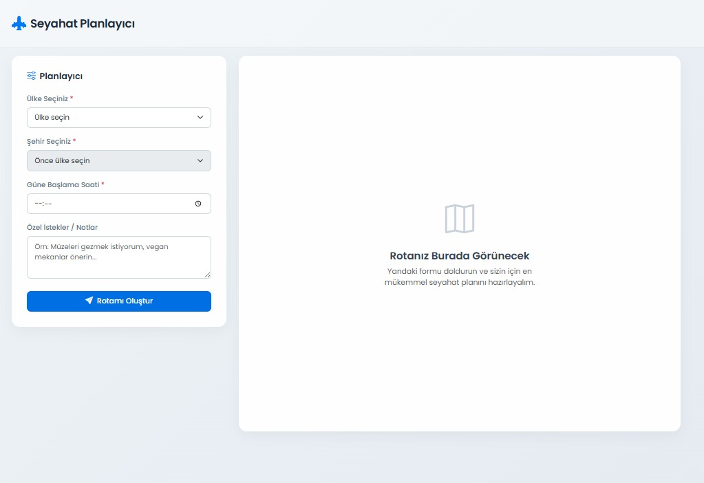
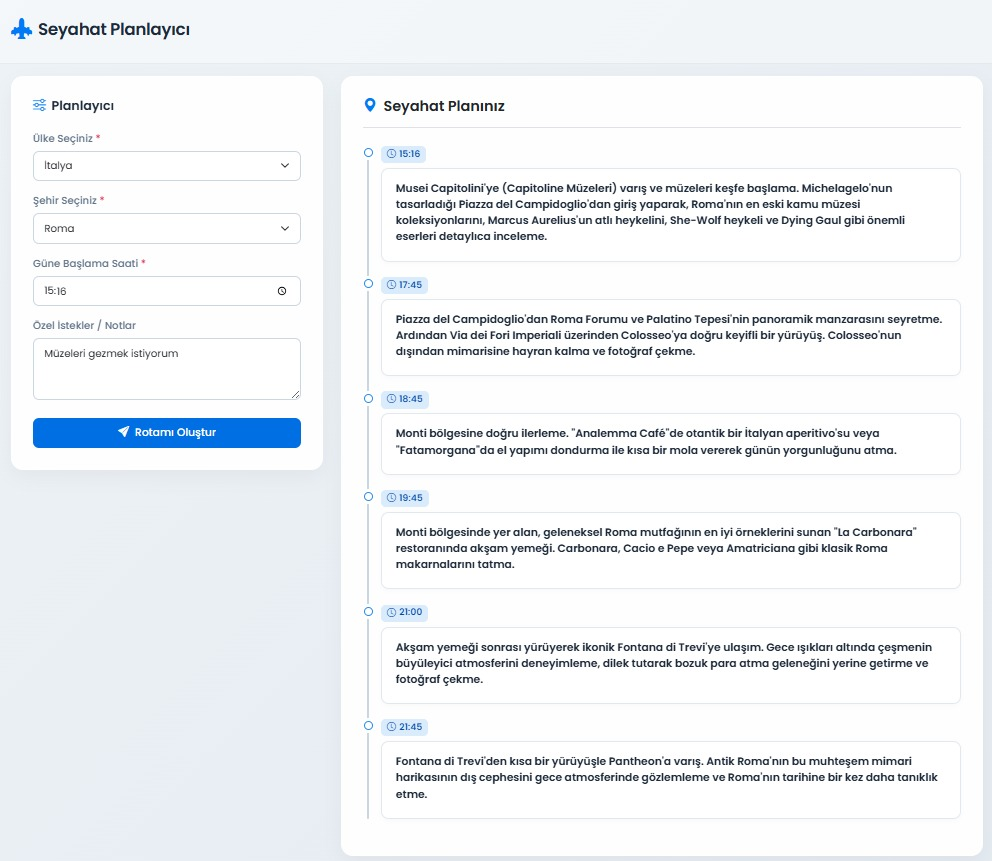

# 🌍 TravelPlanner

TravelPlanner, kullanıcıların ülke ve şehir seçerek yapay zekâ destekli günlük seyahat rotası oluşturabileceği ASP.NET Core tabanlı bir web uygulamasıdır.

Kullanıcı; ülke, şehir, güne başlama saati ve özel notlarını girer. Uygulama Gemini API kullanarak seçilen şehir için saat saat planlanmış bir gezi rotası oluşturur.

---

## 🚀 Özellikler

- Ülke ve şehir seçerek seyahat planı oluşturma
- Gemini API ile yapay zekâ destekli rota önerisi
- Güne başlama saatine göre kişiselleştirilmiş plan
- Kullanıcı notlarına göre rota özelleştirme
- SQL Server veritabanı desteği
- Entity Framework Core ile veritabanı yönetimi
- Katmanlı mimari kullanımı
- Responsive ve modern HTML arayüz

---

## 🛠️ Kullanılan Teknolojiler

- ASP.NET Core Web API
- C#
- Entity Framework Core
- SQL Server
- Gemini API
- HTML
- CSS
- JavaScript
- Bootstrap
- Bootstrap Icons

---

## 📁 Proje Yapısı

```text
TravelPlanner/
│
├── TravelPlanner.API/
│   ├── Controllers/
│   ├── Program.cs
│   └── appsettings.json
│
├── TravelPlanner.Application/
│   ├── Interfaces/
│   └── Services/
│
├── TravelPlanner.Domain/
│   └── Entities/
│
├── TravelPlanner.Infrastructure/
│   ├── Data/
│   └── Migrations/
│
├── TravelPlanner.UI/
│   └── index.html
│
├── images/
│   ├── ana-sayfa.png
│   └── rota-sonucu.png
│
├── README.md
└── TravelPlanner.sln
```

---

## 📦 Gereksinimler

Projeyi çalıştırabilmek için sisteminizde aşağıdakilerin kurulu olması gerekir:

- .NET SDK 9.0 veya üzeri
- SQL Server veya SQL Server Express
- SQL Server Management Studio, isteğe bağlı
- Gemini API Key
- Git

.NET SDK indirmek için:

```text
https://dotnet.microsoft.com/download
```

SQL Server Express indirmek için:

```text
https://www.microsoft.com/sql-server/sql-server-downloads
```

Gemini API key almak için:

```text
https://aistudio.google.com/app/apikey
```

---

## ⚙️ Kurulum

### 1. Projeyi klonlayın

```bash
git clone https://github.com/elifselmanmelih/TravelPlanner.git
```

```bash
cd TravelPlanner
```

---

### 2. Paketleri yükleyin

```bash
dotnet restore
```

---

## 🗄️ SQL Server Yapılandırması

`TravelPlanner.API/appsettings.json` dosyasını açın.

```bash
notepad .\TravelPlanner.API\appsettings.json
```

`ConnectionStrings` ve `Gemini` alanlarını aşağıdaki gibi düzenleyin:

```json
{
  "Gemini": {
    "ApiKey": "BURAYA_GEMINI_API_KEYINIZI_GIRIN"
  },
  "ConnectionStrings": {
    "DefaultConnection": "Server=localhost\\SQLEXPRESS;Database=TravelPlannerDb;Trusted_Connection=True;MultipleActiveResultSets=true;TrustServerCertificate=True"
  },
  "Logging": {
    "LogLevel": {
      "Default": "Information",
      "Microsoft.AspNetCore": "Warning"
    }
  },
  "AllowedHosts": "*"
}
```

SQL Server instance adınız farklıysa `localhost\\SQLEXPRESS` kısmını kendi SQL Server adınıza göre değiştirin.

Örnekler:

```text
localhost\SQLEXPRESS
```

```text
.\SQLEXPRESS
```

```text
YOUR_SERVER_NAME

---

## 🧱 Entity Framework Migration İşlemleri

Önce Entity Framework CLI aracı yüklü değilse yükleyin:

```bash
dotnet tool install --global dotnet-ef
```

Yüklüyse güncellemek için:

```bash
dotnet tool update --global dotnet-ef
```

Veritabanını oluşturmak için proje ana dizininde şu komutu çalıştırın:

```bash
dotnet ef database update --project .\TravelPlanner.Infrastructure --startup-project .\TravelPlanner.API
```

Bu işlem SQL Server içinde `TravelPlannerDb` adında veritabanı oluşturur.

Migration yoksa yeni migration oluşturmak için:

```bash
dotnet ef migrations add InitialCreate --project .\TravelPlanner.Infrastructure --startup-project .\TravelPlanner.API
```

Ardından tekrar veritabanını güncelleyin:

```bash
dotnet ef database update --project .\TravelPlanner.Infrastructure --startup-project .\TravelPlanner.API
```

---

## 🌐 Başlangıç Ülke ve Şehir Verilerini Ekleme

Uygulamadaki ülke ve şehir seçimlerinin dolu gelmesi için veritabanına başlangıç verileri eklenmelidir.

SQL Server Management Studio ile `TravelPlannerDb` veritabanına bağlanın ve aşağıdaki sorguyu çalıştırın:

```sql
USE TravelPlannerDb;
GO

IF OBJECT_ID('dbo.Countries', 'U') IS NULL OR OBJECT_ID('dbo.Cities', 'U') IS NULL
BEGIN
    PRINT 'Countries veya Cities tablosu bulunamadı. Önce migration çalıştırmanız gerekiyor.';
    RETURN;
END
GO

DECLARE @Countries TABLE (
    Name NVARCHAR(200),
    IsoCode NVARCHAR(10)
);

INSERT INTO @Countries (Name, IsoCode) VALUES
(N'Türkiye', N'TR'),
(N'İtalya', N'IT'),
(N'Fransa', N'FR'),
(N'İspanya', N'ES'),
(N'Almanya', N'DE'),
(N'Japonya', N'JP'),
(N'Amerika Birleşik Devletleri', N'US'),
(N'Birleşik Krallık', N'GB');

INSERT INTO dbo.Countries (Name, IsoCode)
SELECT c.Name, c.IsoCode
FROM @Countries c
WHERE NOT EXISTS (
    SELECT 1 FROM dbo.Countries x WHERE x.IsoCode = c.IsoCode
);

DECLARE @Cities TABLE (
    Name NVARCHAR(200),
    CountryIsoCode NVARCHAR(10)
);

INSERT INTO @Cities (Name, CountryIsoCode) VALUES
(N'İstanbul', N'TR'),
(N'Ankara', N'TR'),
(N'İzmir', N'TR'),
(N'Antalya', N'TR'),

(N'Roma', N'IT'),
(N'Milano', N'IT'),
(N'Venedik', N'IT'),
(N'Floransa', N'IT'),

(N'Paris', N'FR'),
(N'Lyon', N'FR'),
(N'Marsilya', N'FR'),

(N'Madrid', N'ES'),
(N'Barselona', N'ES'),
(N'Sevilla', N'ES'),

(N'Berlin', N'DE'),
(N'Münih', N'DE'),
(N'Hamburg', N'DE'),

(N'Tokyo', N'JP'),
(N'Kyoto', N'JP'),
(N'Osaka', N'JP'),

(N'New York', N'US'),
(N'Los Angeles', N'US'),
(N'Chicago', N'US'),

(N'Londra', N'GB'),
(N'Manchester', N'GB'),
(N'Edinburgh', N'GB');

INSERT INTO dbo.Cities (Name, CountryId)
SELECT ci.Name, co.Id
FROM @Cities ci
INNER JOIN dbo.Countries co ON co.IsoCode = ci.CountryIsoCode
WHERE NOT EXISTS (
    SELECT 1
    FROM dbo.Cities x
    WHERE x.Name = ci.Name AND x.CountryId = co.Id
);

SELECT * FROM dbo.Countries;
SELECT * FROM dbo.Cities;
```

---

## ▶️ Projeyi Çalıştırma

Proje ana dizinindeyken şu komutu çalıştırın:

```bash
dotnet run --project .\TravelPlanner.API
```

Uygulama varsayılan olarak şu adreste çalışır:

```text
http://localhost:5146
```

Tarayıcıdan bu adresi açarak uygulamayı kullanabilirsiniz.

---

## 🧪 API Kontrolü

Ülkelerin veritabanından gelip gelmediğini kontrol etmek için:

```text
http://localhost:5146/api/countries
```

Örnek başarılı çıktı:

```json
[
  {
    "id": 1,
    "name": "Türkiye"
  },
  {
    "id": 2,
    "name": "İtalya"
  }
]
```

---

## 🧭 Kullanım

1. Uygulamayı çalıştırın.
2. Tarayıcıdan `http://localhost:5146` adresini açın.
3. Ülke seçin.
4. Seçilen ülkeye göre şehir seçin.
5. Güne başlama saatini girin.
6. İsteğe bağlı olarak özel notlarınızı yazın.
7. `Rotamı Oluştur` butonuna basın.
8. Yapay zekâ tarafından oluşturulan seyahat planını görüntüleyin.

---

## 📸 Uygulama Görselleri

### Ana Sayfa



### Rota Oluşturma Sonucu



---

---

## 🧩 Olası Hatalar ve Çözümler

### SQL Server bağlantı hatası

Hata örneği:

```text
Could not open a connection to SQL Server
```

Çözüm:

- SQL Server servisinin çalıştığından emin olun.
- `SQL Server (SQLEXPRESS)` servisini başlatın.
- `appsettings.json` içindeki server adını kontrol edin.

Örnek bağlantı:

```json
"DefaultConnection": "Server=localhost\\SQLEXPRESS;Database=TravelPlannerDb;Trusted_Connection=True;MultipleActiveResultSets=true;TrustServerCertificate=True"
```

---

### Ülke listesi boş geliyor

Çözüm:

- Migration işlemlerinin çalıştığından emin olun.
- `TravelPlannerDb` veritabanının oluştuğunu kontrol edin.
- Başlangıç ülke ve şehir SQL scriptini çalıştırın.
- Aşağıdaki endpoint’i tarayıcıda test edin:

```text
http://localhost:5146/api/countries
```

---

### Gemini API hatası

Çözüm:

- `appsettings.json` içindeki `Gemini:ApiKey` değerini kontrol edin.
- API key’in geçerli olduğundan emin olun.
---
